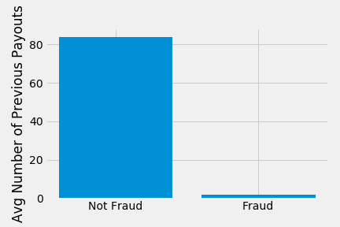
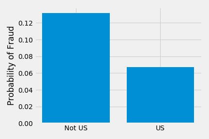
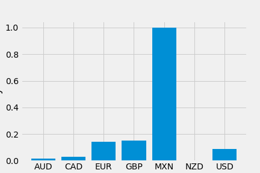
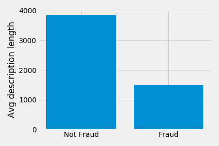
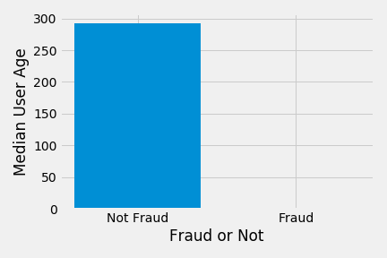
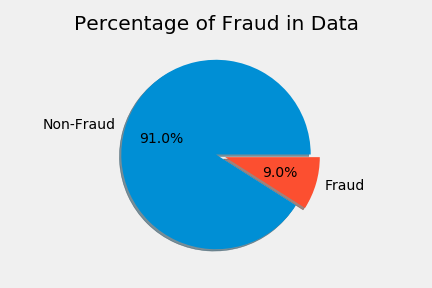
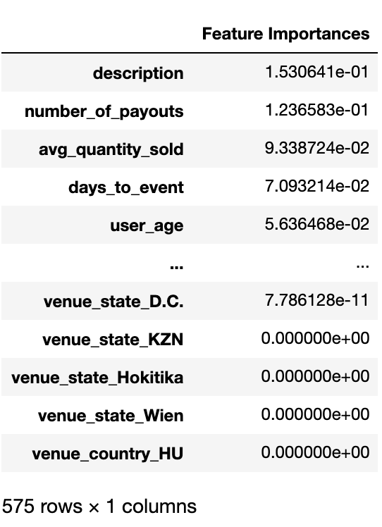
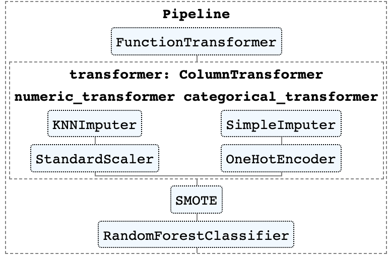
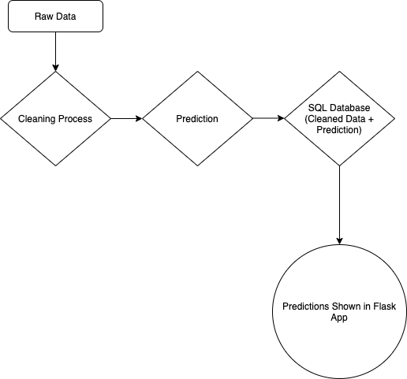

# Summary
The goal of this project was to train and deploy a machine learning model that would take in a stream of raw event data and correclty predict whether or not the event was fraud. A stacked Naive Bayes / Random Forest model was used and attained a holdout F1 score of .94 indicating a very high level of predictive power. This model was then deployed using Streamlit Sharing that displays predictions and data in realtime. Here is a link to the deployed application:

[Deployed Fraud Application Link](https://share.streamlit.io/joshmantova/event-fraud-detection/fraud_app.py)

# Background

* Our client - a website that hosts events - allows users to post events and sell tickets
* Some events will collect money from tickets for an event that isn't actually planned to occur
    * Goal of this project is to be able to take in new events and predict whether or not it is a real event or a fraudulent event
    * Store these predictions and display them for stakeholders to investigate
    * Deploy machine learning model that is capable of predicting in real time

# EDA
We began by trying to explore which variables in the dataset could help us differentiate the non-fraud events from the fraud events.

Events that were marked as fraud received almost no previous payments whereas events that were marked as not fraud recieved several previous payouts.

The probability of fraud given that the event was in the US was much lower than the probability of fraud given that the event was not in the US.

Currency seemed slightly related to fraud in that the probability of fraud differed between different currencies. Having said that, the MXN currency only had one event associated with it.

The average description length for fraudulent events was much lower than the description lengths of non-fraudulent events.

The median user age - which was the age of the account that posted the event - was 0 for fraud events but was much higher for non-fraud events.

Finally, our EDA revealed that there were only a small proportion of events that were fraudulent.

After EDA, we saw that there were several features that could help differentiate between fraudulent events and non-fraudulent events. Because of this, we moved forward with modeling approaches.

# Feature Engineering
* Avg ticket price
* Total number of tickets available for the event
* Avg cost of ticket
* Time until event begins
* Event length
* Probability of a description being a fraudulent event
    * Naive bayes model trained on the descriptions of the event
* NA values were filled with the average for that feature

# Modeling
* Multiple modeling techinques were used and the performance of each was assessed
    * Naive Bayes
    * Random forest model
    * Gradient boosted classifier
    * Adaboost classifier
    * Logistic regression
    * Support vector machines

* Random forest stacked with NLP / Naive Bayes produced best results with a test recall score of .93, and an F1 Score of .94.

* A 5 fold cross validated grid search was then performed to search for optimal hyperparameters for the Random Forest model as well as the description vectorizer. Only two hyperparameters were tuned based on the outcome of the grid search
    * Random forest number of estimators was increased from the default 100 to 3000
    * Vectorizer n_gram range was increased to (1, 2), max features was increased to 10000, and max_df was changed to .90

* Most important features:
    * Description probability from Naive Bayes model
    * Number of Payouts
    * Average quantity sold
    * Days to event
    * User age

* SMOTE techinque used to address class imbalance issues
    * Generated new data points based on our data so that we have equal amounts of fraud and non-fraud events

* Final model included a naive bayes model stacked on top of a random forest model

* The function transfomer in the pipeline visualization below is a function that engineers the features mentioned above, removes any non-useful features, and transforms the natural language descriptions into a probability of fraud using the trained Naive Bayes model

* NOTE: You might think that training a supervised model like the Naive Bayes to predict the label fraud and subsequently using that output as an input to another model may introduce data leakeage and result in overfitting
    * Cross validation reveals that even though there may be some data leakage involved in this approach, the patterns the Naive Bayes model learned from the training data generalizes to unseen data

* Training accuracy score: 1.0
    * Holdout accuracy score: .99

* Training precision score: 1.0
    * Holdout precision score: .93

* Training recall score: 1.0
    * Holdout recall score: .94

* Training F1 score: 1.0
    * Holdout F1 score: .94

* Although I presented multiple model metrics above, the primary metric used to make decisions was F1 due to the nature of imbalanced data and the ability of F1 scores to capture both false positives and false negatives

* It does appear that the Random Forest model is overfitting the data due to the high training scores and differences between training / holdout scores
    * If we wanted to further increase model scores, I'd recommend simplifying the model by tuning hyperparameters, choosing another model, or removing more non-important features

# Deployment

* Note if you're trying to run the code included in this repo: the final predictive model and the data were too large to upload to github. I had to zip them up in order to upload. Be sure to unzip the data file in the data folder and the prediction pipeline file in the models folder before trying to run the code.